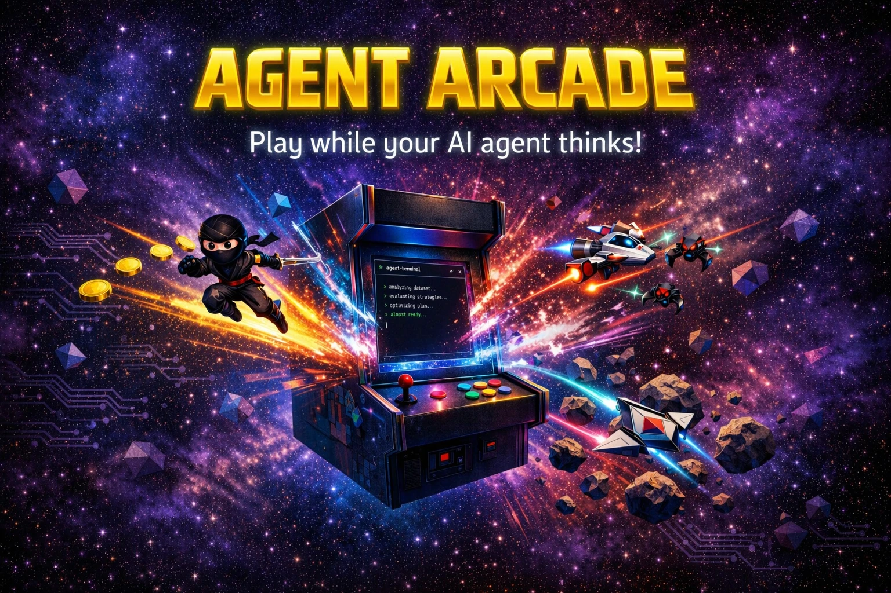
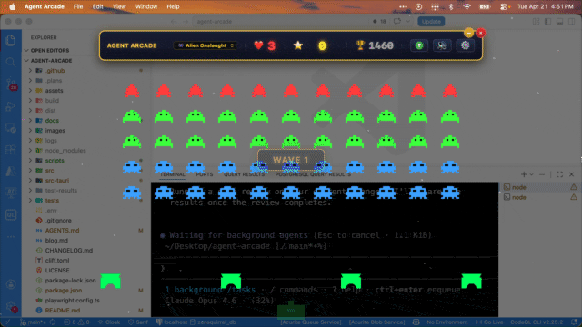

<p align="center">
  
</p>

# 🕹️ Agent Arcade 

A retro arcade game collection that runs as a transparent overlay on your desktop built with [GitHub Copilot CLI](https://github.com/github/copilot-cli). Play while waiting for your AI agents (Copilot CLI, Claude Code, Codex, etc.) to finish thinking and doing their work. Built with Tauri + Phaser + TypeScript.

🔗 Website: [https://danwahlin.github.io/agent-arcade](https://danwahlin.github.io/agent-arcade)

<p align="center">
  <br/>
  <em>👾 Alien Onslaught</em>
</p>

<p align="center">
  <br/>
  <em>☄️ Cosmic Rocks</em>
</p>

<p align="center">
  <br/>
  <em>🚀 Galaxy Blaster</em>
</p>

<p align="center">
  <br/>
  <em>🥷 Ninja Runner</em>
</p>

## 🎮 Games

| Game | Description |
|------|-------------|
| 👾 **Alien Onslaught** | Space Invaders-style arcade action with marching aliens, shields, and mystery ships |
| ☄️ **Cosmic Rocks** | Asteroids-style vector shooter with thrust physics and splitting asteroids |
| 🚀 **Galaxy Blaster** | Galaga-style space shooter with formation enemies and attack patterns |
| 🥷 **Ninja Runner** | Classic platformer with double jumps, power-ups, warp pipes, and enemies |

## How This Was Made

Idea ➡ Reality over a weekend! I used [GitHub Copilot CLI](https://github.com/features/copilot/cli/) (there's a [free course on it here](https://github.com/github/copilot-cli-for-beginners)), and it helped me quickly scaffold the initial Tauri + Phaser + TypeScript project structure. From there I worked with copilot to plan the game mechanics and overall structure. I told it the overall goals and it iteratively built out the game mechanics, integrated the sprite assets, and added the overlay functionality. Still an experimental project, but making good progress.

Blog post about the creation process used with Copilot CLI: [https://blog.codewithdan.com/building-agent-arcade-with-github-copilot-cli/](https://blog.codewithdan.com/building-agent-arcade-with-github-copilot-cli/)

## Installing Agent Arcade

Visit the [releases page](https://github.com/DanWahlin/agent-arcade/releases) and download the installer for your OS. Note that the app is not code-signed, so you may need to bypass security warnings on your OS when installing or running it for the first time. All of the code used in the app installation package is here in the repo - feel free to scan it.

### 🤖 Install this using the Copilot CLI

If you have [GitHub Copilot CLI](https://github.com/features/copilot/cli/) installed, you can install Agent Arcade with a single prompt. Just paste the following into Copilot CLI and it will download and install it:

```
copilot --allow-all -p "Install the latest version of this app for me https://github.com/DanWahlin/agent-arcade/releases"
```

> **Note:** The app is not code-signed, so after installing you'll still need to manually run the commands shown below for your operating system.

### 🍎 macOS

1. Go to the [releases page](https://github.com/DanWahlin/agent-arcade/releases) and expand the **Assets** list to find the `.dmg` file
2. Download the `.dmg` file and open it
3. Drag **Agent Arcade** to your Applications folder
4. **Important:** The app is not code-signed, so macOS will block it on first launch. Open Terminal and run:
   ```
   sudo xattr -rd com.apple.quarantine /Applications/Agent\ Arcade.app
   ```
5. Open Agent Arcade from your Applications folder

### 🪟 Windows

Go to the [releases page](https://github.com/DanWahlin/agent-arcade/releases), expand the **Assets** list, and download the `.msi` installer. Run the installer to complete setup.

> **Note:** The app is not code-signed, so Windows may flag it:
> 1. If your browser warns about the download, select **"Keep"**
> 2. When you see "Windows protected your PC", click **"More info"**
> 3. Then click **"Run anyway"**

### 🐧 Linux

Go to the [releases page](https://github.com/DanWahlin/agent-arcade/releases), expand the **Assets** list, and download the `.AppImage` (universal) or `.deb` (Debian/Ubuntu) package.

> **Note:** For the AppImage, make it executable first:
> ```
> chmod +x Agent-Arcade_*.AppImage
> ./Agent-Arcade_*.AppImage
> ```

## Running Locally

> **Prerequisites:** [Node.js](https://nodejs.org), the [Rust toolchain](https://rustup.rs/), and the [Tauri v2 prerequisites](https://v2.tauri.app/start/prerequisites/) for your platform.

1. Install Rust:

   **macOS/Linux**:
   
   ```bash
   curl --proto '=https' --tlsv1.2 -sSf https://sh.rustup.rs | sh
   source "$HOME/.cargo/env"
   ```

   **Windows**:

   ```bash
   winget install Rustlang.Rustup
   ```
   Restart your terminal after the installation completes.

2. Install the Tauri CLI:
   ```bash
   # Remove any existing version (v1 or otherwise)
   cargo uninstall tauri-cli

    # Install Tauri CLI v2
   cargo install tauri-cli --version "^2"
   ```

3. Clone the repo:
   ```bash
   git clone https://github.com/DanWahlin/agent-arcade.git
   cd agent-arcade
   ```

4. Install dependencies and start the app:
   ```bash
   npm install
   npm start
   ```

## Controls

### 👾 Alien Onslaught

| Key | Action |
|-----|--------|
| <kbd>←</kbd> <kbd>→</kbd> | Move |
| <kbd>Space</kbd> | Fire |

### ☄️ Cosmic Rocks

| Key | Action |
|-----|--------|
| <kbd>←</kbd> <kbd>→</kbd> | Rotate |
| <kbd>↑</kbd> | Thrust |
| <kbd>Space</kbd> | Fire |

### 🚀 Galaxy Blaster

| Key | Action |
|-----|--------|
| <kbd>←</kbd> <kbd>→</kbd> | Move |
| <kbd>Space</kbd> | Fire |

### 🥷 Ninja Runner

| Key | Action |
|-----|--------|
| <kbd>←</kbd> <kbd>→</kbd> | Move |
| <kbd>Space</kbd> / <kbd>↑</kbd> | Jump (press twice for double jump) |
| <kbd>Shift</kbd> | Run |
| <kbd>F</kbd> / <kbd>Z</kbd> | Fire (when powered up) |
| <kbd>↓</kbd> | Enter warp/golden pipes |

### General

| Key | Action |
|-----|--------|
| <kbd>Esc</kbd> | Pause |
| <kbd>Ctrl</kbd>+<kbd>Esc</kbd> | Resume (or click ▶ RESUME) |
| <kbd>Ctrl</kbd>+<kbd>Alt</kbd>+<kbd>M</kbd> | Toggle visibility (all platforms) |
| <kbd>⌘Q</kbd> (Mac) / <kbd>Ctrl+Q</kbd> (Win/Linux) | Quit |

## Building Installers

```bash
npm run dist:mac    # macOS (.dmg + .zip)
npm run dist:win    # Windows (.exe)
npm run dist:linux  # Linux (.AppImage + .deb)
```

Or push a version tag to trigger the CI/CD pipeline:

```bash
git tag v0.2.0
git push origin v0.2.0
```

## Credits

Initially inspired by [Aman's post on X](https://x.com/Amank1412/status/2044489263799275722) about the [Desktop Mario project](https://github.com/bxf1001g/desktop_mario/releases) as well as [Anthony Shaw](https://github.com/tonybaloney) and his [VS Code Pets](https://marketplace.visualstudio.com/items?itemName=tonybaloney.vscode-pets) project.

Thanks to [John Papa](https://github.com/johnpapa) for his Alien Onslaught game PR.

Sprite assets: [Simple Platformer 16](https://juhosprite.itch.io/simple-platformer-16) by JuhoSprite

Space shooter assets: [Space Shooter Redux](https://opengameart.org/content/space-shooter-redux) by Kenney.nl

Galaga-style game mechanics: [WesleyEdwards/galaga](https://github.com/WesleyEdwards/galaga) by Wesley Edwards

Asteroids-style game mechanics: [phaser3-typescript](https://github.com/digitsensitive/phaser3-typescript) by digitsensitive

Retro game sound effects: ["Retro game sound effects"](https://opengameart.org/content/retro-game-sound-effects) by Vircon32 (Carra), published at OpenGameArt under license [CC-BY 4.0](https://creativecommons.org/licenses/by/4.0/)
